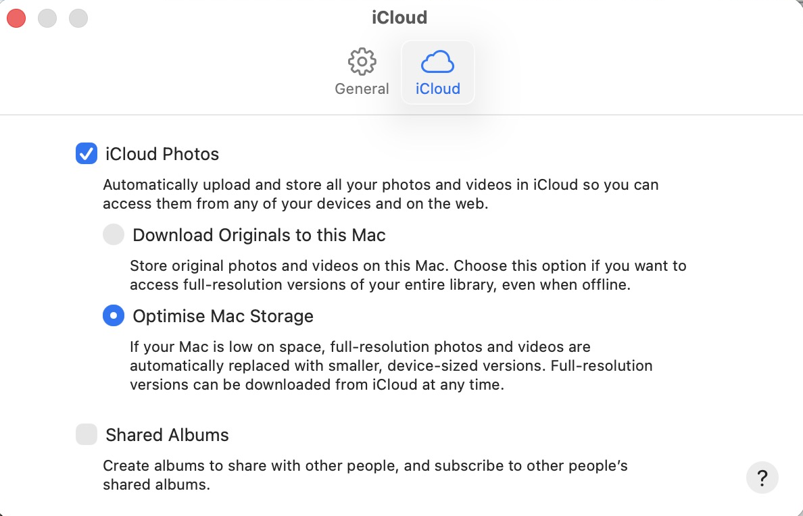

# iPhone Image Manager

**by CloudScale**

> Open source iPhone image backup, cleanup, organization and safe offload for macOS.

[](LICENSE)


iPhone Image Manager is an open source macOS utility that inventories, backs up,
organizes, deduplicates and verifies images and videos from an iPhone. It supports
resumable USB sync, date and location based organization, Google Drive backup,
screenshot and WhatsApp cleanup policies, exact duplicate detection, and explicit
safe removal from the iPhone.

**The default behavior is always to keep media on the iPhone.**

---

## Status

**Pre-alpha.** Nothing touches a device yet, and nothing can delete anything.

| | |
|---|---|
| Documents | [`docs/SPEC.md`](docs/SPEC.md) the specification, [`docs/PLAN.md`](docs/PLAN.md) the plan, [`docs/SAFETY.md`](docs/SAFETY.md) the safety model |
| P0 transport spike | **Complete, and it changed the architecture.** See [`spikes/P0-transport.md`](spikes/P0-transport.md) |
| P1 foundation | Config, schema, migrations, journal, CLI, path builder, retention |
| P0b PhotoKit spike | Next, blocking |

**What P0 found:** USB reaches 1.9% of a real 94,180-item library and the device
refuses deletion outright. The tool now works through PhotoKit against the Mac's
Photos library instead, which also supplies the source application per asset, so
"clean up WhatsApp images" became exact rather than a filename guess.

**Picking this up mid-project?** Start with [`HANDOVER.md`](HANDOVER.md): current
state, measured numbers, decisions already taken, and the mistakes that shaped them.

Read [`docs/SAFETY.md`](docs/SAFETY.md) first if you care about not losing
photographs. It is the shortest document and the one that matters.

### What works today

```bash
iphone-image doctor             # check the MACHINE and say exactly what to change
iphone-image config init        # write a commented example config
iphone-image config validate    # check the CONFIG, and say what it means in practice
iphone-image status             # what the ledger knows
iphone-image journal            # operations, including anything a crash left in flight
```

`doctor` is the one to run first. It checks the things outside this tool's
control and, for anything wrong, prints the fix rather than the symptom:

```
  [ok] platform                macOS, Python 3.14.4
  [ok] external tools          all present: exiftool, ffprobe
  [ok] Apple Account           you@example.com
  [ok] Photos library          ~/Pictures/Photos Library.photoslibrary
  [ok] iCloud storage mode     Optimise Mac Storage (0 of 77,213 targeted local)
  [--] iCloud sync             44,973 assets but zero videos
  [ok] disk headroom           88.0 GB free
  ...
  Usable, with caveats. 11 checks: 10 passed, 1 warning(s), 0 failure(s)
```

It catches the expensive mistake the Photos UI does not warn about: if
**Download Originals** got selected instead of **Optimise Mac Storage**, it fails
and tells you, before your disk fills.

---

## The idea

```
iPhone
   │ scan          build a persistent inventory, touch nothing
   ▼
SQLite Inventory
   │ sync          copy to your Mac, resumably, verified
   ▼
Local Archive
   │ cloud-sync    push to Google Drive
   ▼
Cloud Archive
   │ verify        reconcile all four views of reality
   ▼
                   NOTHING HAS BEEN REMOVED

   │ remove-from-iphone --apply    only when you explicitly say so
   ▼
Space back on your phone
```

Inventory first. Sync second. Verify third. Remove only when explicitly requested.

---

## Planned commands

```bash
iphone-image device            # what is connected
iphone-image scan              # inventory only, never writes to the device
iphone-image sync              # incremental, resumable local backup
iphone-image cloud-sync        # upload verified assets to Google Drive
iphone-image verify            # reconcile device, archive, cloud and database
iphone-image status            # where everything stands
iphone-image list --type screenshot --older-than 60d --min-size 2MB

iphone-image campaign start    # freeze a cleanup set
iphone-image clean screenshots --older-than 60d
iphone-image clean duplicates

iphone-image remove-from-iphone           # shows a plan, removes nothing
iphone-image remove-from-iphone --type screenshot --older-than 60d --limit 25
iphone-image remove-from-iphone --apply   # the only command that deletes

iphone-image recycle-bin list             # what came off the phone, and where it is
iphone-image recycle-bin restore
```

---

## Safety promise

> iPhone Image Manager will never remove an image or video merely because it has
> been seen, copied, or uploaded. Removal is a separate, explicit operation and is
> only offered when the configured verification requirements have been satisfied.

Two specific hazards it is built around, both documented in
[`docs/SAFETY.md`](docs/SAFETY.md):

1. **iCloud "Optimize iPhone Storage".** When it is on, the file a Mac can copy over
   USB may be a downscaled proxy rather than your real photo. Assets that look like
   proxies are backed up but permanently blocked from removal.
2. **iCloud Photos sync.** Deleting on the phone deletes from iCloud and every other
   device. Removal requires a typed confirmation while sync is active.

And two undo paths, because deletion should never be a one way door:

- Anything removed from the phone leaves a **recycle bin entry on your Mac**, with
  the file and a record of why it was eligible. `iphone-image recycle-bin restore`
  brings it back.
- The tool never unlinks archive files. They go to the macOS **Trash**, restorable
  from Finder.

---

## Design goals

- Resumable everywhere. A 40,000 asset library takes days, and the phone will be
  unplugged during it.
- Idempotent. Running `sync` three times converges, it does not duplicate work.
- The SQLite database is the ledger, not a cache. Every removal is backed by
  recorded evidence.
- Privacy first. Media stays local unless you configure a cloud target. No
  analytics. Reverse geocoding is optional.

---

## Setup: point Photos at iCloud, but keep the originals there

This is the one setting the whole design depends on, and the wrong choice will
fill your disk.



**Photos → Settings (⌘,) → iCloud → tick iCloud Photos → select Optimise Mac Storage.**

### Why not "Download Originals to this Mac"

Because a real library does not fit. Measured on the library this tool was built
against:

| | |
|---|---|
| Library | 94,180 items, roughly **424 GB** |
| Free disk on the Mac | **95 GB** |

"Download Originals" would try to pull all 424 GB down before you could do
anything. "Optimise Mac Storage" keeps metadata and thumbnails locally and leaves
the full-resolution originals in iCloud, where iPhone Image Manager fetches them
**one asset at a time, on demand**, in budgeted chunks:

```bash
iphone-image sync --source camera --type photo \
    --order oldest --budget 50GB --pattern "{year}/{month}"
```

So you never need the whole library on disk. You need room for one chunk, plus
wherever your archive lives.

### Two things worth checking first

1. **The Mac and the iPhone must be on the same Apple Account.** Enabling sync
   against a different one would try to upload your Mac's library to the wrong
   place. System Settings → your name → scroll to Devices, and look for your
   iPhone in the list.
2. **The first sync takes hours.** It is pulling metadata and thumbnails for
   every item in the library. Nothing else works properly until it settles.

---

## Requirements

- macOS
- Python 3.12 or newer
- Xcode command line tools, to build the device helper
- `libimobiledevice`, `exiftool`, `ffmpeg`, `rclone` (all via Homebrew)

```bash
brew install libimobiledevice exiftool ffmpeg rclone
```

---

## Development

```bash
git clone https://github.com/andrewbakercloudscale/iphone-image-manager
cd iphone-image-manager

python3 -m venv .venv && source .venv/bin/activate
pip install -e ".[dev]"

ruff check src tests && ruff format --check src tests
mypy src --ignore-missing-imports
pytest tests -q
```

The device helper is a separate Swift package, compiled locally. No code signing
and no Apple Developer account are involved:

```bash
cd spikes/iimhelper && swift build -c release
```

---

## Contributing

The project is at the specification stage. The most useful contribution right now is
a reality check on [`docs/PLAN.md`](docs/PLAN.md), particularly section 5, where the
specification runs into what iOS actually exposes over USB. Issues welcome.

---

## License

MIT. See [LICENSE](LICENSE).
